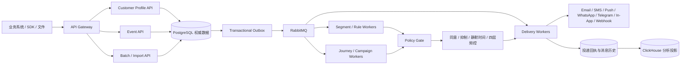

# 瑶光营销平台（Yaoguang Marketing）

<p align="center">
  
</p>

<p align="center"><strong>观心知意，循光达客</strong></p>

面向金融科技及互联网业务的开源用户营销与客户触达平台。

瑶光通过统一 Customer Profile API 和 Event API 接收业务系统实时用户数据，面向动态客群、事件触发、定时任务、营销 Journey、全量 Campaign、A/B 实验、频控治理，以及 Email、SMS、Push、WhatsApp、Telegram、In-App、Webhook 等多渠道触达场景建设统一底座。

> 当前仓库正在按里程碑从 Notifuse 演进为瑶光。品牌、工程标识、运行时配置和简体中文基础已经落地；统一客户身份、可靠批量导入、四层频控及完整多渠道闭环按[总体设计](docs/superpowers/specs/2026-08-29-yaoguang-marketing-platform-design.md)持续实施。文档会明确区分“已经具备”和“目标能力”，避免把路线图误当作已上线功能。

## 当前基础

- Go + React/TypeScript 的自托管营销平台，支持独立 Workspace 隔离。
- 联系人、列表、动态客群、Broadcast、可视化 Automation/Journey、A/B 测试。
- Email、SMS、Push 模板与预览；Twilio SMS、FCM Push 及通用 Webhook 等触达基础。
- 按国家推荐微信、企微、钉钉、飞书、WhatsApp、Telegram、LINE、Zalo、Viber、Messenger、Instagram、Kakao、RCS 与 In-App 等素材渠道；支持多客户端模拟实时预览，新渠道首期通过 HMAC 签名 Webhook 投递。
- PostgreSQL 权威存储、Transactional Outbox、RabbitMQ Worker、Redis 可重建缓存与频控基础、ClickHouse 分析投影、MinIO/S3 资产存储。
- API Key、Workspace 权限、投递回执、消息历史、Web Analytics 和通知中心。
- 瑶光品牌壳、`zh-CN` 界面、中文系统邮件，以及 `YAOGUANG_ROLE` 运行角色配置。

## 目标能力与已确认约束

### 统一客户身份

- 数据库内部使用 UUID 主键，不把外部用户编号当作物理主键。
- 每个 Workspace 拥有独立四位序号；不同 Workspace 的客户完全隔离。
- `external_user_id` 可直接使用业务系统提供的用户 ID，并在同一 Workspace 内唯一。
- 瑶光客户编号格式：`U{workspace_seq:04d}{yyyyMMddHHmmss}{08}{uuid32}`。
- Customer Profile 与 Event 写入都支持幂等键、版本控制和可审计结果。

### 可靠批量入口

- 同步微批默认上限 10,000 条 / 32 MiB。
- 异步 Batch 默认上限 100,000 条 / 256 MiB。
- 文件导入默认上限 10,000,000 行 / 5 GiB，分片默认 5,000 行。
- 默认每个 Workspace 同时运行 2 个导入任务，失败重试 10 次，结果保留 30 天。
- 所有限额都通过后台配置管理；服务端采用流式解析、Manifest、检查点、逐条结果和全量对账，已确认接收的名单不得静默丢失。

### Campaign、Journey 与频控

- Campaign 负责批量、全量、周期任务和独立 Run；Journey 负责持续事件与时间编排。
- 动态客群、事件触发、客户本地时间触发、受众冻结、暂停/恢复和 A/B 实验共享同一执行底座。
- 参考 Mautic 的治理思路，独立设置单活动、事件/定时、批量/全量、跨场景全局四类频控。
- 每次营销触达同时经过活动桶、流量类型桶、渠道桶和全局桶；任一超限即按策略延迟或跳过。
- 全量 Campaign 不绕过营销同意、退订、投诉、黑名单、静默时间或频控，也不挤占事件触发的独立额度。
- 本阶段不新增审批或双人复核，保留现有发布权限与行为。

## 目标架构



设计原则：PostgreSQL 是在线权威来源；RabbitMQ 负责耐久任务流；Redis 只保存可重建的短期状态；ClickHouse 只保存可重建分析投影；所有外部副作用都必须可幂等重放和核对。

## 本地启动

需要 Docker Desktop 和 Docker Compose。

```powershell
Copy-Item env.example .env
docker compose up -d --build
docker compose ps
```

默认入口：

- Console 与 API：`http://localhost:8081/console/`
- Notification Center：`http://localhost:8081/notification-center/`
- RabbitMQ 管理台：`http://localhost:15672`
- MinIO 管理台：`http://localhost:9001`

Compose 会把内置 MinIO 自动作为未配置 Workspace 的默认文件存储，无需在文件管理器中再次填写。已有 Workspace 的显式 S3 配置保持优先；如修改 MinIO API 宿主端口或通过反向代理暴露，请同步设置 `S3_PUBLIC_ENDPOINT` 为浏览器可访问的地址。

默认 Compose 适合源码开发，Go 和 React 源码均挂载并启用热更新。共享或生产部署前必须在 `.env` 中更换 `SECRET_KEY`、数据库、RabbitMQ、Redis、ClickHouse 和 MinIO 示例凭据。

高可用的角色拆分拓扑：

```powershell
docker compose down
docker compose -f compose.ha.yaml up -d --build
```

`YAOGUANG_ROLE` 支持 `all`、`api`、`outbox-relay`、`rule-worker`、`journey-worker`、`delivery-worker`、`analytics-worker` 和 `scheduler`。`NOTIFUSE_ROLE` 仅作为一个兼容周期的回退变量；两者同时配置时以 `YAOGUANG_ROLE` 为准。

为保证既有部署平滑升级，数据库前缀、默认数据库名、RabbitMQ 对象、S3 Bucket、缓存键和数据卷等持久化标识暂不改名。

## 项目结构

```text
cmd/                    Go 应用入口
config/                 运行配置
internal/domain/        领域模型
internal/service/       业务服务
internal/repository/    数据访问
internal/http/          HTTP API
console/                React 管理控制台
notification_center/    嵌入式通知中心
telemetry/              遥测模块
docs/                   设计与实现文档
plans/                  分阶段实施计划
```

## 与衡枢真信开源产品的关系

- [hscredit](https://github.com/hengshu-credit/hscredit)：风险策略分析与建模。
- [tianshu-decision-engine](https://github.com/hengshu-credit/tianshu-decision-engine)：将分析结论部署为在线决策服务。
- 瑶光营销平台：接收实时客户与事件数据，将洞察编排为合规、可追踪的客户触达。

## 实施文档

- [平台总体设计](docs/superpowers/specs/2026-08-29-yaoguang-marketing-platform-design.md)
- [实施总计划](plans/yaoguang-marketing-platform-program-plan.md)
- [品牌与工程基础计划](plans/yaoguang-brand-shell-plan.md)

## 上游与许可证

瑶光营销平台基于 [Notifuse](https://github.com/Notifuse/notifuse) 改造，并参考 [Mautic](https://github.com/mautic/mautic) 与 [Laudspeaker](https://github.com/laudspeaker/laudspeaker) 的产品设计。仓库保留上游版权、许可证和历史归属。

本项目依据 [GNU Affero General Public License v3.0](LICENSE) 发布。部署或分发修改版本时，请遵守 AGPL-3.0 的源代码提供义务。

安全问题请通过本仓库的 [GitHub Private Vulnerability Reporting](https://github.com/hengshu-credit/yaoguang-marketing/security/advisories/new) 私密提交；普通缺陷和需求请使用 [GitHub Issues](https://github.com/hengshu-credit/yaoguang-marketing/issues)。
